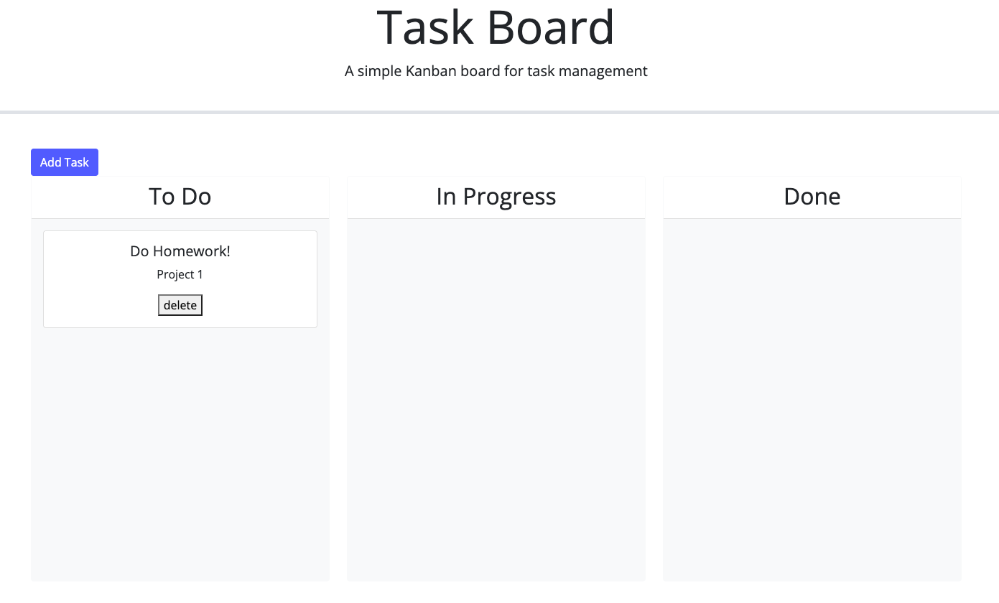

# Task Board
 

## Description
This [application](https://nvanschaack.github.io/task-board/) is a great tool for someone who is looking to organize their to-do lists. All in one page, the user is able to add any number of tasks they need to get done, are working on, or have completed!

## Technologies
- HTML5
- CSS3
- JavaScript (version ES6+)
- Bootstrap
- Day.js
- jQuery

## Usage
In this application, the user will be able to add their tasks using the "Add Task" button located at the top of the page. They will be prompted to add their task name, description, and due date. Once they submit their task, it will be easily viewable on the board. If they start working on a particular task, the user can drag the task card to the "In Progress" column. When the user is done with the task, they can drag the card again to the "Done" column. The user also has the option the delete the task all together if needed. 

## Credits
- [Bootstrap](https://getbootstrap.com/)
- [jQuery](https://releases.jquery.com/)
- Collaboration with tutor, Vinnie Lopez (jlopez@instructors.2u.com)

## License
Please refer to the LICENSE in the repo.
